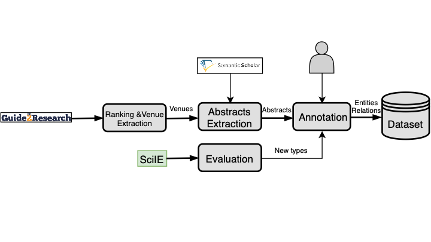

# Automatic Interpretation of Scientific Papers.

There has been an exponential increase in the volume of scientific publications in the past decades, making the organization of the scientific information a strategical task for identifying new technologies and their relationships with what existed before.

## 

## Methodology

Sample abstracts from a semantic scholar gzip dataset files added in 'semanticScholarParser' folder

The pipeline describing our approach:

